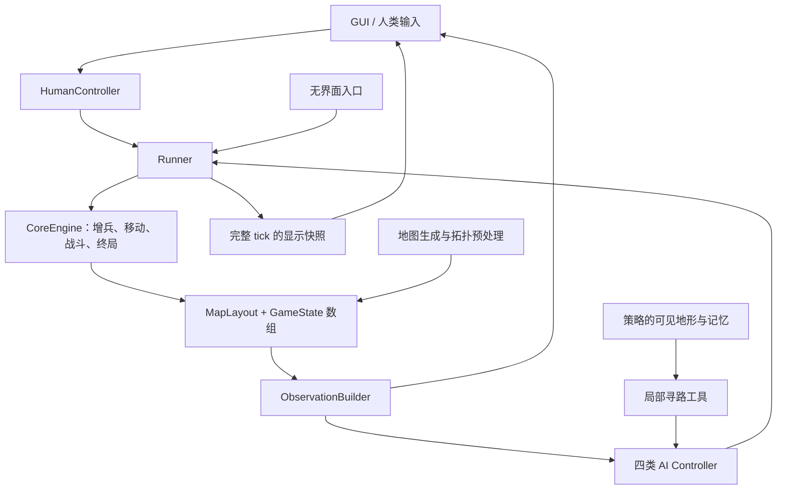

# Generals CPU 原型设计方案

版本：v0.4（CPU 原型已实现；保留本方案的规则与架构约定）  
日期：2026-09-26  
开发环境：本机 conda 环境 `generals-rl`  
GUI 目标平台：Windows 与 Linux 图形桌面  
规则参考：`/home/yuhangwang/code/bzy-nya.github.io/gen`  
实施状态：用户已授权实施，CPU 原型、GUI、四种 AI、无界面模拟及测试已落地于 `env/`；`rl/` 仅保留说明。安装和实际验证记录见 [implementation_report.md](implementation_report.md)。Windows 实机及不同系统 DPI 的验收仍待完成。

## 1. 目标和范围

实现一个能在 CPU 上运行的 Python 原型，清晰表达现有游戏的规则，同时提供可实际游玩的桌面 GUI。支持 2–8 个玩家的自由混战：一个人类玩家对抗其余 AI，或者全部由 AI 自动对战。

本期交付应包含：

- 一套独立于界面、策略和真实时间的游戏规则实现。
- 四类基本 AI：进攻、扩张、防御、随机。
- 与原模拟器类似的方格地图、兵力数字、阵营颜色、排行榜和控制面板。
- 人类的选格、相邻移动、分兵、路径排队和取消操作；基本游玩可全程使用鼠标，键盘提供快捷操作。
- 实时运行、暂停单步、无界面非实时运行。
- 明确的状态、动作、观测、结算结果，以及最小的地图预处理接口。
- 可复现的地图与策略随机数、规则测试、基本性能测量。

GPU 并行模拟和强化学习训练均属于后续工作。本期只为它们保留必要的抽象边界，不实现 CUDA 算子、GPU 批量环境、训练框架适配、奖励函数、神经网络或训练流程，也不引入这些功能的依赖。

本期同样不包含联网、匹配、账号、聊天、组队、地图编辑器、声音、完整录像播放器或官网其他地形。这些功能都不是验证游戏规则与交互所必需的。

## 2. 主要设计决策

| 项目 | 本期选择 | 理由 |
|---|---|---|
| 数值状态 | NumPy 连续数组 | 用明确的整数数组描述规则，便于批量运算与后续更换执行后端 |
| GUI | Python 标准库 `tkinter`、`ttk`、`Canvas` | 已有 Tk 安装记录；小型二维棋盘足够使用，减少新增依赖 |
| 规则执行 | 同步、确定性 CPU 函数 | 输入状态和动作决定输出，不依赖帧率、窗口或策略对象 |
| tick 内顺序 | 先增兵，再按玩家编号依次行动 | 保留 JS 实际采用的顺序和决策信息时刻 |
| 时间控制 | Runner 负责，核心只认识 tick | 实时和无等待运行使用同一套规则 |
| AI 实现 | 手写启发式策略，公共工具复用 | 保留四种行为特征，修复遗留缺陷 |
| 信息规则 | 玩家和 AI 默认使用局部观测，观战显示全图 | 延续原 AI 的视野概念，并补全人类视角；严禁寻路暗中读取未知地图 |
| 路径工具 | 四邻接 BFS、按需单源距离缓存 | 足够处理原地图规模，无需 NetworkX 或 SciPy |
| 测试 | 标准库 `unittest` | 不额外引入测试框架 |

读取本机安装元数据确认：环境位于 `/home/yuhangwang/miniforge3/envs/generals-rl`，包含 Python 3.12.14、NumPy 2.5.2、Tk 8.6.13、PyTorch 2.13.0+cu130。实施阶段已验证 Linux/X11 GUI 和 CPU 运行；未验证 Windows GUI 或 CUDA 运行。本期不使用 PyTorch/CUDA 执行游戏，也不安装 CUDA 编译组件。

Tkinter 的事件循环适合把短小的计算任务与界面刷新分开调度；耗时计算需要分段交还事件循环。设计遵循其线程与事件循环约束，所有 Tk 操作放在主线程。参考 [Python 3.12 Tkinter 文档](https://docs.python.org/3.12/library/tkinter.html)。是否需要换用其他 GUI 框架，应由原型的实际显示问题决定，而不是预先增加依赖。

## 3. 规则依据和兼容边界

规则的优先级：本文件明确的规则约定 > JS 可观察的合理游戏行为 > JS 注释。JS 中的偶然实现缺陷不构成需要兼容的规则。

官网仅用于参考操作习惯。本期的经济、战斗、出生、结算顺序以本地模拟器为基础，不引入官网现行版本的其他规则。例如，中立城市维持本地的 40 兵初始驻军。

| 类别 | 保留或补充的内容 |
|---|---|
| 必须保留 | 四类地块、增兵周期、四邻接移动、留一兵／半兵、严格大于才能攻占、主城淘汰、领土继承 |
| 必须保留 | 每方每 tick 最多一个动作；按编号结算；后行动的 AI 看到前面动作的结果 |
| 修复实现问题 | 无上限递归、状态统计滞后、胜负滞后、路径进度错误、非法动作防护、视野泄漏 |
| 新增产品能力 | 人类玩家、完整的 2–8 人选项、输入队列、单步、无界面模拟、固定种子 |
| 明确的设计补充 | 人类局部视野的展示方式、队列失败处理、回合上限的截断语义、生成器有限终止 |
| 不承诺复现 | 相同随机数下与 JS 完全相同的地图、AI 每一步选择、因原 bug 产生的战局 |

本地源码依据：

- [game.js](/home/yuhangwang/code/bzy-nya.github.io/gen/js/game.js:52)：增兵、战斗、继承、合法性。
- [main.js](/home/yuhangwang/code/bzy-nya.github.io/gen/js/main.js:195)：每 tick 的驱动与行动顺序。
- [map.js](/home/yuhangwang/code/bzy-nya.github.io/gen/js/map.js:59)：地图与初始兵力。
- [baseAI.js](/home/yuhangwang/code/bzy-nya.github.io/gen/js/ai/baseAI.js:34)：视野和记忆。
- [ai.js](/home/yuhangwang/code/bzy-nya.github.io/gen/js/ai.js:9)：四种 AI 的分配。

## 4. 完整规则规范

### 4.1 棋盘、玩家和开局

- 使用 `H × W` 矩形方格棋盘，不环绕边界。
- 玩家数 `P` 是 2–8 的任意整数；每个玩家有固定编号 `0…P-1`。
- 所有玩家互为敌人，不存在队友或联盟。
- 每方开局拥有一个主城，主城驻军为 1，其他地块不属于该玩家。
- 普通空地初始无人占领，驻军 0。
- 中立城市初始驻军 40，不属于任何玩家。
- 山脉不可进入，不拥有归属或军队。
- 初始 `tick = 0`，开局不额外发放兵力。

GUI 地图预设为 15×15、25×25、35×35，默认 25×25。默认总人数 4、山脉目标密度 20%、城市目标密度 10%。GUI 支持山脉密度 0–40%、城市密度 0–20%。纯核心可以接受符合约束的小尺寸地图，以方便规则测试。

### 4.2 增兵

每个 tick 开始时先令 `tick += 1`，随后按照新的 tick 值统一增兵：

| 地块 | 增兵条件 | 增量 |
|---|---|---|
| 玩家拥有的主城 | `tick % 2 == 0` | 每格 +1 |
| 玩家拥有的城市 | `tick % 2 == 0` | 每格 +1 |
| 玩家拥有的普通地块 | `tick % 50 == 0` | 每格 +1 |
| 无主空地、中立城市、山脉 | 无 | 0 |

第 50 tick，主城和城市只获得本身的 +1，不额外获得普通领土增兵。所有地块按全局周期结算，不记录“占领后经过多少时间”。本 tick 刚占领的格子不会追补本 tick 已经完成的增兵。

平局战斗可以留下 0 兵的已占领格。它仍按所属地块类型正常增兵。受损的中立城市不会自动回复到 40。

默认 1 倍速时 0.5 秒一个 tick，因此主城／城市约每秒 +1，普通领土约每 25 秒 +1。真实时间不参与规则判定。

### 4.3 单个动作

每个玩家在自己的行动时隙最多提交一个动作：

- `WAIT`：不移动，也消耗本次行动机会。
- `MOVE(source, direction, mode)`：从一个格子移动到四邻接目标。

方向固定编码为 `UP=0, RIGHT=1, DOWN=2, LEFT=3`。移动模式为 `ALL_BUT_ONE` 或 `HALF`，不支持自定义出兵数量。

移动合法的全部条件：

1. 对局尚未结束，玩家编号有效且玩家仍存活。
2. 来源和目标都在地图范围内。
3. 来源属于行动玩家；0／1 兵也允许提交移动。
4. 目标是上下左右相邻格，不是来源本身，也不是山脉。
5. 本 tick 尚未处理过这个玩家的动作。

普通移动派出 `max(0, n - 1)` 兵；半兵移动派出 `floor(n / 2)` 兵。来源立即扣除派出兵力；原有至少 1 兵时保留至少 1 兵，原有 0 兵时仍为 0。0／1 兵对应零兵转移，指令正常结算并消耗本次行动时隙，不等待未来增兵。

不能因为某次攻击预计会失败而把它定义为非法。合法性与策略好坏分离。

### 4.4 战斗与合并

令派出兵力为 `a`，目标驻军为 `d`：

| 目标 | 结果 |
|---|---|
| 己方格 | 目标兵力变为 `d + a` |
| 无主空地 | `a > 0` 时归进攻者，兵力为 `a`；`a == 0` 时保持无主 |
| 敌方格或中立城市，`a > d` | 攻占；目标归进攻者，兵力为 `a - d` |
| 敌方格或中立城市，`a < d` | 未攻占；目标归属不变，兵力为 `d - a` |
| 敌方格或中立城市，`a == d` | 未攻占；目标归属不变，兵力变为 0 |

除主城被攻占后变城市外，战斗不改变地块类型。战斗没有随机伤害。攻击一个 0 兵敌方格也需要派出至少 1 兵。

例子：10 兵普通移动攻击 5 兵，派出 9，来源剩 1，目标被占领且剩 4。41 兵普通移动攻打 40 兵中立城市，只能打到 0，不能占领；42 兵才足以一次占领。

### 4.5 主城被攻占

主城被成功攻占的同一个动作内，依次完成：

1. 攻下的主城归进攻者，保留正常战斗剩余兵力。
2. 败方 `alive = false`。
3. 这座主城的建筑类型改为城市。
4. 把此时仍属于败方的其他地块转交给进攻者。
5. 每个转交地块的兵力改为 `max(1, floor(old_army / 2))`。
6. 清除败方后续控制输入，禁止它在本 tick 后续时隙行动。

被直接攻下的主城不再参与第 4、5 步，不能把其战斗剩余兵力又减半。之前已经被别人占领的地块也不参与继承。

继承中的“至少 1 兵”是本地实现的明确规则。因此继承前 0 兵的格子会变为 1 兵；不能为了追求简单的兵力守恒而删除这一行为。

### 4.6 一个 tick 的严格顺序

顺序是规则的一部分：

1. 若已结束，拒绝继续推进，状态不变。
2. `tick += 1`，处理该 tick 的增兵。
3. 从玩家 0 到玩家 `P-1` 依次处理。
4. 若玩家已被淘汰，跳过它；否则基于该时刻状态构造观测、取得一个动作并立即执行。
5. 每次行动内即时处理淘汰和继承。一旦只剩一方，停止剩余行动。
6. 根据最终棋盘计算统计，更新终局结果，发布一个完整 tick 的结果。

后行动者能够观察到前行动者已造成的变化。这是原 JS 的实际行为，因此本期不改为“所有玩家同时决策、同时移动”。两个玩家攻击同一格时，后一个攻击的是前一次结算后的格子；双方试图互相攻占主城时，先成功者获胜，败方动作不再执行。

固定编号存在先手偏差。本期保留这个兼容行为，记录座位和行动次序。后续比较策略可在不同对局交换座位，但不在此版本偷偷轮换 tick 内的顺序。

### 4.7 终局、截断与中断

- `terminated = true`：按照游戏规则仅剩一个存活玩家，`winner_id` 为其编号。
- 玩家个人被淘汰时，其 `alive` 立即为 false；如果尚有多个其他玩家存活，全局对局继续。
- `truncated = true`：Runner 达到配置的 `max_ticks`，本局停止采样，但没有自然胜者。
- 人工停止记录为 `user_stop`；策略抛异常记录为 `controller_error`，不能伪装成胜负。
- 不根据总兵力或领土在截断时强行评定胜者。
- 自然终局与回合上限恰好同时发生时，优先记录自然终局。

核心不强制时间上限。GUI 默认不限 tick；命令行批量运行默认给出有限 `max_ticks`，以避免启发式 AI 僵持造成无限运行。运行终止原因与棋盘的自然终局状态分开保存。

## 5. 原实现检查结果与处理方案

以下来自静态阅读，不是已经执行复现过的测试报告。涉及行为变化的项目在实现时都需要独立验收。

| 位置／现象 | 影响 | Python 处理方式 |
|---|---|---|
| 三个规划型 AI 的 `selectObjectiveAndPlan()` 无目标时递归调用自身 | 无有效策略时可能无限递归；也可能在重试中浪费大量时间 | 对有限候选遍历，给重规划次数明确上限，失败后返回 WAIT |
| 三个 AI 的 `followPath()` 在结算前增加 `pathIndex` | 攻击没有攻下目标时，路径指针却假定已经前进 | 根据 `MoveResult` 确认目标已归己方后才推进路径 |
| `planPath()` 读取完整 `game.grid` 的山脉 | AI 的局部视野会被寻路绕过 | 策略只得到观测与自身记忆，局部模式寻路不得接触真值拓扑 |
| `Game.update()` 在动作之前更新统计 | 动作后界面的兵力／领土滞后一拍 | 统计从权威数组派生，GUI 只用 tick 完成后的统计 |
| 主城捕获时只置败方死亡，之后才做全局结束检查；驱动还有外层检查 | 胜负展示延迟，结束后可能多增兵或多走一步 | 捕获后即时确认胜负；结束后拒绝后续推进 |
| `isValidMove()` 没有完整校验存活、终局与玩家身份 | 独立 API 调用可能绕过驱动层的防护 | 所有公共动作入口执行同一套完整验证 |
| 随机 AI 使用随机比较函数排序 | 不是定义清楚的随机抽样，分布依赖排序过程 | 使用显式随机排列或加权抽样，结果受种子控制 |
| 山脉／城市通过有放回坐标尝试放置，碰撞不补足 | 密度滑块与实际数量偏离 | 无放回抽样，并分别显示目标密度与打通路径后的实际密度 |
| 普通地块注释写 25 tick，判断是 `% 50` | 移植时容易把经济速度翻倍 | 明文锁定 50 tick，以规则测试覆盖 |
| 部分攻击打分用来源总兵力比较，未扣留守兵或考虑半兵 | 误判可攻占目标，防御型半兵尤其可能失败 | 打分统一通过 `movable_army()` 估算真实出兵数 |
| 敌方主城猜测／敌情记忆缺少充分失效处理 | 已失效目标可能长期影响决策 | 用最新可见事实覆盖旧记录，删除已淘汰目标，普通敌情按 TTL 失效 |
| 多处重复全图扫描、BFS 每个节点复制路径、数组头部出队 | 放大 CPU 开销 | 共享派生结果，使用 `deque` 和父节点数组恢复路径 |

最后两项包含策略和性能改进，不改变战斗规则。地图重新生成也不要求复刻 JS 的随机分布。规则测试不能完全以 JS 为真值来源，否则会把已识别缺陷固化为兼容要求。

## 6. 系统拆分与依赖方向

核心划分为五个职责明确的部分：



- **CoreEngine** 只做规则变换。不 import Tk，不引用 AI，不读取键盘，不 sleep，不自行抽随机数。
- **Controller** 输出动作。人类、四种 AI、预录制动作都使用同一协议。
- **Runner** 管理 tick 时隙、控制器、运行模式、停止条件及结果汇总。
- **ObservationBuilder** 把权威状态转换为某个玩家允许获得的信息。
- **GUI** 只渲染快照和更新人类输入队列，不直接修改棋盘数组。

首期一个主线程即可运行 GUI 与短小 CPU 任务，不预设多线程共享状态。无界面运行不创建窗口，也不 import GUI 子包。

上述规则、地图、运行器、GUI、人类控制器和四种基本 AI 全部属于独立的 `generals_env` 包，放在仓库的 `env/` 子项目中。未来 RL 代码放在同级 `rl/` 子项目，使用独立的 `generals_rl` 包。包依赖只允许 `generals_rl → generals_env`，环境不能反向导入训练代码。具体目录与接入边界见第 15 节。

## 7. 数据模型

### 7.1 静态地图与动态状态

将不可通行的地形和会变化的建筑分开，避免“主城变城市”使静态最短路缓存失效。

| 数据 | 形状／类型 | 含义 |
|---|---|---|
| `MapLayout.terrain` | `[H, W]`, `uint8` | `PLAIN=0`, `MOUNTAIN=1`，对局中只读 |
| `MapLayout.height/width` | Python 整数 | 地图尺寸 |
| `MapLayout.topology_id` | 稳定摘要 | 尺寸、地形内容和邻接规则共同决定 |
| `GameState.structure` | `[H, W]`, `uint8` | `NONE=0`, `CITY=1`, `GENERAL=2` |
| `GameState.owner` | `[H, W]`, `int16` | `EMPTY=-1`, `NEUTRAL=-2`, 玩家编号 `0…P-1` |
| `GameState.army` | `[H, W]`, `int64` | 驻军，非负整数 |
| `GameState.alive` | `[P]`, `bool` | 是否存活 |
| `GameState.general_pos` | `[P]`, `int32` | 初始主城的一维位置；淘汰后仍用于标识原位置 |
| `GameState.tick` | 整数 | 已开始／完成的逻辑 tick，由事务阶段解释 |
| `GameState.terminated` | `bool` | 自然终局 |
| `GameState.winner_id` | 整数或 `None` | 自然胜者 |

数组采用 C-contiguous 行优先布局，二维坐标统一为 `[y, x]`，动作一维位置 `cell_id = y * W + x`。所有位置转换集中在公共函数中，避免行列颠倒。

`MapConfig`、`RulesConfig`、`RunConfig` 和玩家名称／颜色属于配置或展示元数据，不塞进逐格状态。第一版 `RulesConfig` 固定本文件的兼容规则，只暴露确实使用的配置，不做任意规则编辑器。

不为每个格子创建 Python 对象，也不在格子里存放字符串、路径、绘图元素或 AI 引用。兵力使用整数，避免浮点半兵和比较误差；首期不为节省少量内存压缩为可能溢出的窄整数。

### 7.2 权威状态与派生数据

唯一的棋盘真值是以上数组。以下都是可重算的派生信息：

- 各玩家总兵力、领土数、城市数。
- 可移动来源、边界格、视野掩码、局部合法动作掩码。
- 绘制需要的颜色、文字、图标、选中状态。

统计不由各个战斗分支分别累加维护，以免继承、0 兵格或失败攻击导致计数漂移。首期从 `owner`、`army` 重算；兵力统计保持整数精度，不通过浮点加权统计再转换回来。

如果后续缓存派生信息，需要显式的状态版本或阶段失效机制。同一个 tick 内前方玩家行动后，下一玩家不能复用旧视野或旧统计。

### 7.3 必须成立的不变量

- `army >= 0`；山脉上 `structure=NONE, owner=EMPTY, army=0`。
- 无主普通格 `army=0`；`NEUTRAL` 仅用于中立城市，可有 0–40 兵。
- 玩家拥有的格子允许 0 兵，不能强制所有已占领格至少 1 兵。
- 每个存活玩家恰有一座属于自己的主城；被淘汰玩家不再拥有地块。
- 所有 `GENERAL` 必须对应一个存活玩家的 `general_pos`。
- 已结束状态不得继续增兵、行动或消耗策略随机数。
- 正常规则不会出现 0 个存活玩家；若外部载入此状态应报状态错误。

调试与测试模式在 tick 边界验证不变量；高速运行不每次执行昂贵的全量断言。

### 7.4 动作和结果

语义动作可使用轻量 `dataclass`：`Action(kind, source, direction, mode)`。边界上还定义可转换的固定整数编码；`WAIT` 显式编码，不能依赖 `None` 的多重含义。

一个 `MoveResult` 至少包含：动作是否有效、是否移动、未执行原因、来源／目标、出兵数、是否攻占、是否淘汰玩家。常见原因包括 `WAIT`、`INSUFFICIENT_ARMY`、`NOT_OWNER`、`OUT_OF_BOUNDS`、`MOUNTAIN`、`ELIMINATED`。

合法但未攻占的攻击是成功执行的动作，不是非法动作。路径控制器必须看 `captured` 或结算后目的格归属，不能只看 `valid`。

`TickResult` 包含 tick 编号、按行动顺序排列的结果、淘汰事件、最终统计、`terminated` 和 `winner_id`。Runner 另外提供 `truncated`、停止原因和运行性能统计。无需给核心附加奖励字段。

无效游戏动作不改变棋盘，并消耗该玩家本次时隙；错误的数据类型、错误的 API 调用阶段或重复提交玩家则属于编程错误，应抛异常，而不是静默变成 WAIT。

## 8. 推进接口与确定性

### 8.1 核心的事务接口

以下为接口草案，不是本轮要执行的代码：

```text
reset(map_config, seed) -> 初始状态
begin_tick() -> 完成 tick 递增与增兵，进入玩家时隙
apply_action(player_id, action) -> MoveResult
finish_tick() -> TickResult

step(actions_by_player) -> TickResult
observe(player_id, mode) -> Observation
snapshot(view) -> 只读显示快照
```

`begin_tick/apply_action/finish_tick` 只供 Runner 或确定的调用适配器使用。引擎检查阶段、递增玩家编号和每个玩家最多一次，GUI 不直接调用这些方法。一个完整 tick 对 GUI 是原子更新；AI 的即时观测则位于各自时隙。

在 `step(actions_by_player)` 中，调用者已经提供每个玩家的动作；引擎仍按相同规则逐个结算。必须显式为 tick 开始时存活的玩家提供 MOVE 或 WAIT，之前已经淘汰的玩家用 WAIT 占位。如果某玩家在本 tick 轮到自己前被淘汰，其已提交的 MOVE 被跳过，不能当作调用者编程错误。该接口便于脚本和动作重放。

`step` 与逐时隙调用必须共用同一批底层规则函数，不允许复制两套经济或战斗代码。主城淘汰导致的后续动作跳过也完全相同。

### 8.2 原版兼容的控制器驱动

```text
begin_tick()
for pid in 0 ... P-1:
    如果已经自然终局，结束循环
    如果 pid 被淘汰，跳过其时隙
    obs = observe(pid)              # 包含本 tick 增兵和前方玩家动作
    action = controller[pid].act(obs)
    result = apply_action(pid, action)
    controller[pid].on_result(result)
result = finish_tick()
```

控制器协议只需要 `reset(...)`、`act(observation)` 和 `on_result(result)`。人类控制器从队列取动作，没有输入时输出 WAIT；规则核心不等待键盘输入。

预先准备一组动作与让 AI 在各自时隙决策，是两种动作提供方式：只要实际动作相同，规则结果相同；如果决策依据的信息时刻不同，不保证策略会选择相同动作。这一点必须写入接口说明，不能用整 tick 开始时的同一份观测替换原版顺序决策后还声称完全等价。

### 8.3 随机数与复现

- 使用明确的整数种子；GUI 展示当前种子，命令行允许传入。
- 地图与每个 AI 使用独立的 NumPy RNG 子流，按固定玩家槽位派生。
- GUI 颜色、刷新、鼠标移动、缓存命中等不得消耗策略随机数。
- 同一规则版本、地图、策略版本、种子和逐时隙动作序列，应产生相同结果。
- 对复现要求高的运行，记录初始数组、配置、版本、种子及实际动作，不能只依赖种子跨版本复现。
- 纯动作重放不重新调用 AI。

本期可以提供可选 JSONL 动作日志与程序级重放检查，不做录像播放 UI。高速运行默认关闭逐 tick 日志和完整历史保留。

## 9. 视野与观测

### 9.1 可见性规则

默认 `LOCAL` 模式：己方所有领土，以及每块领土周围一格的八邻域可见，包括对角线。可见性不会改变四邻接移动规则，山脉不会遮挡这一格范围内的视野。

原页面全图显示，原 AI 自己维护局部视野，但没有实现严格的信息隔离。本期补全为：

- AI 观战模式：GUI 全图显示；每个 AI 仍使用自己的局部观测。
- 人类模式：GUI 和人类控制器使用该玩家的局部观测，AI 使用同样规则。
- 调试可选 `FULL` 模式：所有控制器都获得全图信息；记录在对局配置中，不能悄悄只给某方开放。
- 人类淘汰并选择继续观战后，可以显示全图，且不可重新接管玩家。

这是本原型明确选择的简化信息规则，不声称复制官网全部迷雾细节。

### 9.2 观测内容与隔离

`Observation` 至少提供：自己的玩家编号、tick、允许看到的地形／建筑／归属／兵力数组、可见掩码、所有玩家存活状态，以及公开的总兵力和领土统计。实现中的 `stats.cities` 在 LOCAL 下仅自身为真实值，其他玩家为 `-1`，避免泄露未知区域的城市总量；FULL 和全图观战可获得真实值。

- 不可见位置采用独立的 UNKNOWN 编码：地形／建筑 `255`，归属 `-3`，兵力 `-1`；同时提供 `visible`。
- UNKNOWN 只存在于观测，不能混入权威 `GameState`。
- 主城位置默认只直接给自己；敌方主城通过可见格发现。
- 排行榜总兵力与领土数公开，延续原 UI；它们不等于透露逐格分布。
- 控制器不能得到 `GameState` 引用、全图邻接缓存或包含敌军隐藏位置的事件流。
- 观测采用独立快照／受控只读数据，不能用写入 NumPy 视图的方式篡改核心。

GUI 展示已探索但当前不可见的格子时，可以保留变暗的已知地形；隐藏当前归属、建筑和兵力。历史敌情如需展示，只能明确标为历史，不能表现为当前真值。首期无需在 GUI 显示复杂敌情记忆，AI 可以自行维护带 tick 的记忆。

### 9.3 合法动作信息

可构造 `[H*W, 4, 2]` 的布尔动作掩码和一个 WAIT 标志，用于 GUI 提示、策略调试及以后适配外部控制器。本期按需生成，不要求每步都构造完整动作空间。

掩码只表达当前规则上能否执行，不能把“打不过”标成非法。局部模式下，己方来源周围目标都在视野内，所以立即动作的山脉判定不需要泄漏未知信息。

提前规划的队列不能把这个掩码当成未来保证：之前的玩家可能夺走来源，军队也可能在上一动作后不足。实际执行时必须重新验证。

### 9.4 特征预处理的扩展位置

除最短路外，未来可能需要把状态转换为策略输入。本期只确定两类入口的边界：

```text
prepare_map(layout) -> StaticFeatures
transform_observation(observation, permitted_features) -> FeatureView
```

`prepare_map` 和通用拓扑查询由 `generals_env` 提供，在地图创建后执行，结果绑定 `topology_id`。`transform_observation` 是外部控制器适配层的扩展位置；与训练模型有关的通道编码、归一化或历史堆叠未来放在 `generals_rl`，接受已经完成信息裁剪的观测，不能写入核心状态。初期直接传递原始数组即可，不实现特征流水线框架或任何特定训练模型的输入编码。

局部模式只能向第二个入口提供由玩家已知信息计算的特征。全图静态特征允许用于全信息调试或离线检查，不能仅因为“只计算了一次”就成为所有玩家的公开输入。动态特征按决策时隙重算，或用包含 tick 内状态版本的键缓存。

## 10. 地图生成与预处理

### 10.1 有限、可复现的生成流程

1. 校验人数、尺寸、密度范围，以及可用普通格足以放下全部主城。
2. 根据种子生成格子排列，无放回放置 `floor(H*W*mountain_density)` 个山脉。
3. 从剩余格子无放回放置 `floor(H*W*city_density)` 个城市，驻军 40。
4. 从普通格选择不同的主城位置，初始目标间距沿用 `floor(min(H,W)/3)` 的欧氏距离尺度。
5. 候选不足时按确定顺序逐级降低距离要求；所有搜索有有限上界，不无限随机重试。
6. 从第一个主城位置做四邻接 flood fill；城市在拓扑上可通行，攻城消耗由战斗处理。如果已经覆盖所有非山脉格，跳过修复。
7. 否则以该连通区域的全部格子为起点，执行一次多源 0–1 BFS：进入普通格或城市的代价为 0，进入山脉为 1，记录父节点。
8. 从每个尚未连接的原始非山脉格沿父节点回溯，标记已连接节点并收集需要移除的山脉；遇到已连接节点即停止。所有回溯共享标记，每个节点最多被回溯一次，最后统一移除收集到的山脉。
9. 放置主城、初始化玩家，计算最终地图摘要，返回初始状态。GUI 根据最终地形展示实际密度。

所有非山脉格必须属于同一个四邻接连通块，包含空地、城市与主城；不能只验证主城之间互通。连通性检查与修复的总时间、辅助空间均为 O(H×W)，不再按主城或孤岛数量重复搜索整图。

修复只移除山脉，不填埋原有空地，不改变城市或主城的已选位置。单条接入路径优先少挖山，但不保证全局移除的山脉总数最少，也不保证资源完全对称。设置的山脉密度是修复前的目标，实际密度可能更低。同版本、同配置和种子仍可复现；相同种子的最终地形可能与旧生成器不同。

设置变化时生成预览；开始对局时使用该预览的初始状态副本，不再重新抽图。人类 LOCAL 模式的预览也遵守其视野，不能先把所有主城展示出来再隐藏。

### 10.2 最短路工具的定义

地形图：非山脉为节点，上下左右移动为单位代价边。城市、主城、敌方领土不会阻断这张静态图。

最小接口：

```text
neighbors(topology) -> [H*W, 4]，越界或不可通行位置为 -1
single_source_distances(topology, source) -> int32[H*W]
shortest_path(topology, source, target) -> 路径或不可达
```

距离为最少移动边数；同一可通行格到自身为 0，不可达为 -1。山脉来源视为无有效路径，不能将 `-1` 当作 NumPy 的最后一行去索引。

CPU 首期实现 BFS，使用 `deque` 和父节点数组；按 `(topology_id, source)` 缓存单源结果，限制缓存容量。相同不可通行地形可以复用，reset、尺寸变化或规则改变后不能误用旧缓存。

全点对距离的输出契约可定义为 `int32[N,N]`，`N=H*W`，通过重复 BFS 构造。首期不默认预计算整个矩阵；可以在实现基本功能后提供一个显式 CPU 预处理入口，其实现复用单源 BFS，不引入新库。

| 地图 | N | 全点对 int32 距离的内存，仅计距离 |
|---|---:|---:|
| 15×15 | 225 | 约 0.19 MiB |
| 25×25 | 625 | 约 1.49 MiB |
| 35×35 | 1225 | 约 5.72 MiB |

不缓存每一对点的完整路径，避免更大的存储开销。以后大量地图并存时，是否保留全点对结果由调用者决定，本期不设计 GPU 缓存系统。

### 10.3 静态距离、策略路径和视野的边界

静态最短距离不等于“当前可以安全走完的路径”。例如沿途必须留兵，城市需要攻城，敌军会行动；路径工具不能把这些动态条件藏进固定距离中。

完整真值地图的预处理只向调试／全信息调用方开放。默认 LOCAL 模式的 AI 使用已见地形及自身记忆，未知地形可按探索假设暂视为可通行，遇到新信息再规划。其缓存键包含玩家的地形知识版本，不能复用全图真值距离。

仅在最终输出时遮掉未知格是不够的：一条由完整地形算出的绕山最短路本身也可能泄漏信息。因此观测构造之前和之后的预处理服务要在接口上分开。

## 11. 四种基本 AI

### 11.1 公共流程

保留原实现“按倾向选策略、评价目标、规划并执行路径”的特点。共享以下工具：可移动来源、已知边界、合法相邻格、真实出兵数、稳定 softmax、局部 BFS、带时间的敌情记忆。

每个决策执行有界流程：

1. 更新本时隙观测和策略记忆。
2. 若当前路径仍有效，尝试下一步。
3. 否则生成有限的来源／策略／目标候选集合。
4. 优先在有候选的策略中按权重选择，规划可达路径。
5. 路径失败可检查其余候选，但设置确定的搜索次数上限。
6. 没有合理动作时 WAIT，允许积兵。

计算预算由候选数量、BFS 次数等确定性计数控制，不能依据机器上已经消耗的毫秒数提前截断，否则机器负载会改变决策结果。

### 11.2 初始策略参数

| 类型 | 保留的策略权重／温度 | 保留的主要行为 |
|---|---|---|
| 进攻型 | 合兵 0.5、探索 0.8、进攻 1.5；温度 0.5 | 偏向兵多且靠前的来源；高估值敌方主城和城市；通常派出除留守外的全部兵 |
| 扩张型 | 扩张 1.5、占城 1.2、集结 0.5；温度 0.6 | 优先空地和有能力夺取的城市，沿边界扩展；扩张到空地且来源兵力 >6 时可半兵 |
| 防御型 | 加固 1.5、集结 1.0、扩张 0.3；温度 0.7 | 支援薄弱边界与受威胁主城／城市；谨慎扩张；扩张或兵多的加固行动偏好半兵 |
| 随机型 | 保留较大随机评分，以及占空地、优势进攻的小加分 | 随机选择可移动来源与邻格，带少量局部判断；较多兵力时随机分兵 |

这些是原代码的策略倾向起点，不保证与 JS 同一步选同一动作。随机型不退化为完全均匀随机，也不继续使用随机排序比较器。

防御型／扩张型评价攻击收益时必须用计划中的出兵模式计算 `a`；“来源有足够兵”不能自动代表半兵也打得过。

### 11.3 路径与记忆的生命周期

- 只有目的格在结果中仍属于己方，才把军队路径锚点移到该格。
- 战斗未攻占、来源丢失、已知山脉阻断、目标失效时，清除或重规划路径。
- 每 tick 最多走一个相邻步骤，不能把 BFS 整条路径一次写入棋盘。
- 可沿用进攻／扩张／防御路径的 20／25／15 tick 重规划上限，但无效时立即处理。
- 普通敌情保留至多 50 tick；新可见事实立即覆盖旧事实。
- 记住的敌方主城坐标可保留，直到确认失效或该玩家淘汰；不把它当作可见的当前驻军。
- 全局 reset 时清空策略路径、记忆和随机数状态。

观战时默认按进攻、扩张、防御、随机循环分配。人类模式保留一个 Human 席位，其他 AI 席位按同样顺序循环，GUI 允许逐席位选择类型。人类默认编号 0，允许开局前换座位。

## 12. GUI 与人类交互

### 12.1 布局和显示

```text
┌──────────────────────────────────────┬────────────────────┐
│                                      │ 玩家 / 策略        │
│                                      │ 领土 / 兵力 / 存活 │
│          可缩放、可平移的地图          │                    │
│                                      │ tick / 速度 / 状态 │
│                                      │ 当前选择 / 出兵模式│
│                                      │ 队列长度 / 提示    │
├──────────────────────────────────────┴────────────────────┤
│ 开始  暂停  单步  同图重开  新地图  速度  设置  操作帮助    │
└───────────────────────────────────────────────────────────┘
```

棋盘用阵营底色、兵力数字和简洁的矢量形状表达状态：山脉用三角轮廓，城市用城堡形状，主城用王冠形状。图标使用 Canvas 图元，不依赖字体里的特殊符号或外部图片资源。

选中格使用明显边框，队列使用方向箭头，半兵动作标注 `½` 或 `50%`。无法执行时显示明确原因。对 0 兵已占领格和无主空地保留归属颜色区别，不能因为数字为 0 就画成空地。

排行榜按兵力排序，展示名称、策略、领土与兵力；淘汰方保留灰色行并标记淘汰，便于理解战局。自身行有额外标识。配色同时配合编号、图标和文字，不只依赖颜色区分。

### 12.2 操作映射

官网版本记录确认了 WASD／方向键移动、Q 清空队列、E 撤销最后排队动作、Z 切换半兵、空格取消选择等操作习惯；本原型沿用这些主要键位。参考 [generals.io 官方版本记录](https://generals.io/versions)。下面的鼠标细节、暂停键与队列失败语义是本原型的明确约定，不宣称与官网所有设置逐项一致。

| 输入 | 行为 |
|---|---|
| 左键点己方格 | 选择作为来源；即使只有 1 兵也可选择 |
| 已选择时，左键点规划光标的相邻格 | 将该方向移动加入队列并前移规划光标；己方相邻格也可用于合兵 |
| 再次点击当前选中格，或按 Z／点击半兵按钮 | 切换下一条新指令为半兵／普通；入队后恢复普通 |
| WASD／方向键 | 从规划光标向相邻格追加一条指令，并前移规划光标 |
| Shift + 左键点己方格 | 强制切换来源，解决“相邻己方格点击会移动”的歧义 |
| Q／清空队列按钮 | 清空尚未执行的队列，规划光标回到当前有效的执行锚点 |
| E／撤销末步按钮 | 删除最后一个尚未执行的动作，并回退规划光标 |
| 空格／取消选择按钮 | 取消选择，不清空已排队动作，也不暂停游戏 |
| H／选择主城按钮 | 选择自己的主城；按新的来源选择规则处理旧队列 |
| 鼠标中键或右键拖动 | 平移地图 |
| 鼠标滚轮、界面 +/− | 缩放地图 |
| Home／适应窗口按钮 | 恢复地图居中及适合窗口的缩放 |
| P／暂停按钮 | 暂停／继续 |
| 单步按钮 | 仅暂停时可用，推进所有玩家的一个完整 tick |

非相邻敌方格不触发自动寻路；首期的人类路径由连续点击相邻格或方向键逐格输入。切换到新的来源会清除旧路径队列并提示，避免同时管理多支人类军队的队列分支；这是简化交互范围的选择。

半兵、清空队列、撤销末步、取消选择和选择主城均在控制面板中提供可点击按钮，与快捷键调用同一个输入处理函数。仅用鼠标切换到相邻己方来源时，可以先点“取消选择”再选择该格，无须按 Shift。基本游玩不依赖键盘；自定义种子等文本输入仍可使用键盘。

键盘输入焦点处于种子、人数等表单时，不触发游戏快捷键。鼠标像素坐标先反变换为地图坐标并检查边界，缩放不能改变选择结果。按键自动重复可以追加动作，但队列有长度上限，窗口失去焦点时清除按键保持状态；人类模式自动暂停。

### 12.3 队列的精确定义

`HumanController` 保存最多 64 个明确的 `MOVE`，每条含来源、方向和模式。队列属于控制器，不属于游戏状态。

需要区分两个位置：

- **执行锚点**：最近一次已经成功到达的己方格。
- **规划光标**：排队路径的末端，允许位于尚未占领的空地或敌方格。

排队只表达意图，不立即修改军队。允许排队经过尚未攻占的格子，但每一步在所属 tick 重新校验。

E 只撤销尚未执行的最后一条意图，不回滚已经发生的战斗。删除到队列为空时，规划光标回到执行锚点；如果锚点已经失去归属，则取消选择。空格只隐藏当前选择，保留已有队列和执行锚点；需要停止排队行动时使用 Q。

| 执行结果 | 队列与选择处理 |
|---|---|
| 合兵成功或成功占领目的格 | 弹出队首，执行锚点移动到目的格，继续后续队列 |
| 出发格仍是己方，但只有 0／1 兵 | 本时隙正常执行 MOVE，转移 0 兵并消耗队首；目标为己方则照常前移执行锚点，未占领目标则清除后续路径 |
| 攻击合法但未攻占 | 该动作已消耗；弹出它并清空后续依赖路径，选择留在来源 |
| 来源已丢失、地图边界或山脉使路径无效 | 本时隙不产生移动，清空失效路径，给出提示 |
| 玩家被淘汰 | 清空队列，关闭玩家输入，提供继续观战或重开入口 |

不能在一个 tick 内连续跳过多个无效动作后再额外执行一个有效动作。暂停时允许规划、撤销和切换出兵模式；只有单步或恢复后才结算。

### 12.4 会话状态与设置

GUI 会话状态为 `PREVIEW`、`RUNNING`、`PAUSED`、`FINISHED`。人类被淘汰但全局未结束时，完成当前 tick 后立即暂停，在下一个 tick 前展示选择；继续观战恢复同一场对局，不重建引擎。

设置至少包含：模式（人类／观战）、总人数、席位策略、地图大小、两种密度、随机种子。调试用全信息模式可放在设置的次要区域。

- 地图和席位设置仅在预览可修改；运行或暂停后锁定，防止 UI 配置与对局真值不一致。
- **同图重开**恢复同一初始地图、席位与策略种子，清空动作和记忆。
- **新地图**选择新种子并重新生成预览；显示新种子。
- 切换速度不清空队列，不重置增兵计数。
- 终局后禁用行动和继续，保留观察地图和重开能力。

### 12.5 绘制与事件循环

Canvas 每格创建固定的背景、数字和必要图元，更新已有元素而不是每帧删除重建。兵力／归属仅在 tick 或视图变化时刷新；拖动、选择和队列提示可以独立刷新。

目标显示刷新约 30 FPS，实际模拟频率由 Runner 决定。缩放和平移只操作显示坐标。首期不做大型动画系统，也不让每个模拟 tick 必须对应一帧画面。

中文字体优先选系统现有中文字体，缺失时给出可读的英文标签回退。实施阶段分别验证 Windows 和 Linux 的窗口与输入；无显示环境下的 headless 模式仍应可用。

### 12.6 Windows 与 Linux 桌面适配

GUI 目标是两个平台上的本地桌面窗口。Tkinter 支持 Windows 和 Unix/Linux，使用本期的 Tk/Canvas 方案不需要为了 Windows 重写规则或更换 GUI 框架。参考 [Python 3.12 Tkinter 文档](https://docs.python.org/3.12/library/tkinter.html)。这属于技术选型可行性；当前没有完成原型或双平台运行验证。

| 事项 | 实施要求 |
|---|---|
| 运行依赖 | 两个平台均安装可用的 Python、NumPy、Tk；CPU 游玩不依赖 CUDA、GPU 或 RL 包 |
| Linux 显示 | 需要可用的图形显示服务；按 Tk 8.6 的 X11 显示路径验证，对应桌面的兼容显示配置在实施时确认；纯无显示会话使用 headless |
| 鼠标输入 | 左键点击、中键／右键拖动在两个平台保持相同行为；所有基础指令提供按钮入口 |
| 滚轮缩放 | 将平台滚轮事件归一化为统一缩放方向和步长，不在规则层处理差异；保留 +/− 按钮 |
| 字体与 DPI | 枚举可用字体并回退，验证系统缩放下文字可读、按钮不截断；绘图与鼠标命中使用同一坐标变换 |
| 文件与启动 | 使用跨平台路径处理与包资源定位，不将本机 Linux 绝对路径写入程序运行逻辑；模块入口相同 |
| 焦点与关闭 | 在两个平台检查窗口失焦暂停、释放鼠标拖动、关闭窗口后取消定时回调等行为 |

Tk 8.6 的滚轮事件存在平台差异：Windows 通常使用 `<MouseWheel>`，X11 通常使用 `<Button-4>` 和 `<Button-5>`。这些事件在 `gui/input.py` 中统一转换，并按实际 Tk 窗口系统绑定，避免一次滚动被重复处理。参考 [Tk 8.6 事件绑定文档](https://www.tcl-lang.org/man/tcl8.6/TkCmd/bind.htm)。

桌面适配不会改变动作或 tick 的规则。首期通过 Python 模块启动，独立 Windows 可执行文件或 Linux 安装包不属于本次原型交付。

## 13. 实时、单步与非实时运行

### 13.1 实时模式

1 倍速目标为每秒 2 tick，支持 1×、2×、5×、10×。使用单调时钟累计经过时间，按完整 tick 推进，不把“渲染了一帧”等同于“只处理一次 tick”。

通过 Tk 的定时回调运行短任务。每次 GUI 回调限制处理的完整 tick 数量或时间预算，并保留未处理的模拟时间债务；不能为了追上画面而丢弃经济结算或跳过动作。暂停／继续时重设真实时间基准，暂停时间不累积为待补跑 tick。

如果机器负载太高，显示实际 tick/s 和滞后提示，允许显示变慢。一次 tick 必须完整执行，不能在攻击和领土继承之间渲染半成品状态。

### 13.2 暂停单步

暂停时停止逻辑推进，但继续处理选格、排队、缩放等 UI 操作。点击单步时所有存活玩家各获得一次行动机会，然后仍保持暂停。它不是只执行人类一个动作。

没有人类输入时仍可单步，HumanController 返回 WAIT。使用相同动作日志时，单步结果必须与实时模式一致。

### 13.3 Headless 非实时模式

不创建 GUI、不调用渲染、不等待真实时间、不逐帧复制显示快照。Runner 在普通循环中连续执行 tick，直到自然终局、上限或显式停止。

无界面入口默认全 AI，也接受预先提供的动作序列；不启用交互式人类输入。可以顺序运行多局并汇总结果，但本期不做多进程或 GPU 批量环境。

高速模式默认只保留当前状态、策略必要记忆和有限缓存。关闭逐 tick 文本输出、完整轨迹和昂贵调试断言，结束时汇总种子、胜者、tick 数、停止原因及耗时。

可选的 GUI 快进只对观战开放：在短回调里尽量推进多个完整 tick，低频刷新，仍能暂停。它不会达到纯 headless 的吞吐，不能当作性能基准。

### 13.4 性能测量

实施后分别测量，避免把 AI 寻路开销误认为规则核心开销：

| 测量对象 | 内容 |
|---|---|
| 核心规则 | 固定地图、预生成动作，不调用 AI，不渲染 |
| 端到端模拟 | 四种 AI 决策、观测、完整规则，无 GUI |
| 地图初始化 | 生成、连通性修复、预处理分别计时 |
| GUI | 25×25／35×35，2／8 人，拖动、输入和 10× 下的响应 |

记录 CPU、Python／NumPy 版本、地图、人数组合、tick/s、完整局数/s、峰值内存及是否启用日志。对照使用相同种子与配置，不在未测量前承诺某个加速倍数。

首期优化只做明显有益且不破坏可读性的部分：数组掩码增兵、避免重复扫描、共享 BFS、限制策略重规划、关闭无界面显示开销。性能不足时先测量，再决定下一步。

## 14. 为后续工作保留的抽象

以下只规定本期边界，不设计 GPU 或强化学习系统：

| 现在建立的边界 | 对后续工作的作用 |
|---|---|
| 连续数组承载地形、归属、兵力与存活状态 | 后续可更换为其他数组／张量后端，也可在外层增加环境批次维度 |
| 经济与动作结算为独立确定性操作 | 能用 CPU 参考实现验证未来加速实现的规则等价性 |
| tick 内固定顺序、明确的决策时隙 | 避免未来优化时无意改变冲突解决和信息时刻 |
| 动作有固定整数编码，WAIT 明确 | 外部策略无需模拟鼠标键盘即可控制玩家 |
| 真值状态、观测、策略记忆分离 | 可以独立替换特征处理，不把隐藏信息混入玩家输入 |
| 合法动作掩码为可选派生数据 | 外部调用方可按需要使用，核心不绑定具体策略结构 |
| 自然终局、个人淘汰、运行截断分开 | 后续调用方能够正确处理不同的生命周期结果 |
| 地图拓扑预处理与局部知识寻路分开 | 可复用静态特征，同时明确哪些信息允许传给玩家 |
| GUI 只接受快照，Controller 只接受观测 | 未来替换执行后端时不必重写基本交互 |
| 规则测试和种子／动作记录 | 为后续实现提供可比较的 CPU 语义基线 |
| 独立的 `generals_env` 包与单向依赖 | 环境可以独立安装、运行与测试，RL 算法在另一个目录演进 |

增兵可以用数组掩码加法实现，但单个 tick 内的玩家动作存在顺序依赖，主城捕获还会改变整个败方领土。不能只因为状态是矩阵，就把同局所有玩家动作当成可无条件同时执行。未来并行化应保留这里冻结的可观察语义。

本期不会为了“以后可能 GPU 化”编写张量后端分发器、CUDA 占位代码、通用批处理框架或训练接口。只用清晰的数据与函数边界使将来有可替换的位置。

## 15. 独立游戏环境与 RL 的目录结构

### 15.1 单仓库、两个独立子项目

采用 `env/` 与 `rl/` 两个同级目录。各自拥有 Python 包、依赖声明和测试，仓库根目录保留总体说明与设计文档。这样开发游戏、启动 GUI 或运行规则测试时不需要进入 RL 项目，也不需要安装训练依赖。

本期只实施 `env/`。下列 `rl/` 内容仅表示未来代码的归属，不在 CPU 原型阶段创建算法、模型或训练脚手架。实施后 `env/` 已按下述结构建立；`rl/` 本期仅创建 README，下面列出的 RL 包和测试是未来规划。实际细节以环境使用说明及实现记录为准。

```text
generals-rl/
  README.md                           # 仓库说明与两个子项目的入口
  doc/
    cpu_prototype_design.md

  env/                                # 完整、独立的游戏环境子项目
    pyproject.toml                    # 分发名称 generals-env；CPU 运行依赖 NumPy
    README.md                         # 环境安装、游玩、无界面模拟与规则说明
    src/
      generals_env/                   # Python 导入名称 generals_env
        __init__.py                   # 导出稳定的环境接口；不导入 GUI/RL
        __main__.py                   # play / watch / simulate 入口
        config.py                     # 地图、规则、运行与席位配置
        state.py                      # 数组状态、Action、MoveResult、TickResult
        engine.py                     # 增兵、合法性、战斗、继承、tick 事务
        mapgen.py                     # 可复现地图与连通性保证
        observation.py                # 玩家观测、公开统计、显示快照
        pathfinding.py                # BFS 与有边界的拓扑缓存
        runner.py                     # 控制器轮转、停止条件、非实时循环
        recording.py                  # 可选动作记录与程序级重放
        controllers/
          __init__.py
          base.py                     # Controller 协议和基础策略公共工具
          aggressive.py
          expansion.py
          defensive.py
          random_policy.py
          human.py                    # 人类输入队列与动作结果反馈
        gui/
          __init__.py
          app.py                      # Tk 生命周期、设置、按钮、时钟调度
          board.py                    # Canvas 渲染与坐标变换
          input.py                    # 键位、选格、焦点与队列可视化
    tests/                            # 环境独立验收，不依赖 RL
      test_rules.py
      test_tick_order.py
      test_mapgen.py
      test_observation.py
      test_controllers.py
      test_runner.py
    benchmarks/
      benchmark_cpu.py                # 核心与四种 AI 的 CPU 吞吐测试

  rl/                                 # 未来 RL 子项目，本期只预留归属
    pyproject.toml                    # 未来单独声明环境及训练依赖
    README.md
    src/
      generals_rl/
        algorithms/                   # RL 算法及训练逻辑
        models/                       # 可学习的策略和价值模型
        adapters/                     # 环境协议与训练/推理接口之间的转换
        features/                     # 模型相关的特征编码和预处理
    configs/                          # 训练与实验配置
    tests/                            # 算法、适配器和环境集成测试
```

`env` 是源码子项目目录；`generals-rl` 仍是现有 conda 环境名，两者含义不同。使用 `generals_env` 和 `generals_rl` 作为包名，也避免把完整游戏包命名为 RL 包而混淆职责。

根目录本期无需再增加一个统管两者运行依赖的 `pyproject.toml`，也无需引入 workspace 管理工具或公共 `common/` 包。环境自己的 `pyproject.toml` 足以描述 CPU 原型。今后如需统一格式化等开发配置，可以独立增加，不改变包依赖方向。

### 15.2 明确代码归属

| 内容 | 归属 | 边界 |
|---|---|---|
| 规则、状态、地图、战斗、胜负、合法动作 | `env/` | 定义所有调用方共同遵守的游戏语义 |
| 视野裁剪、原始观测、静态拓扑和最短路 | `env/` | 提供通用信息，不绑定某个模型的特征布局 |
| GUI、人类输入、四种启发式 AI | `env/` | 保证环境独立可玩，也提供基准对手 |
| tick 调度、真实时间节拍、单步、纯规则无界面运行 | `env/` | 环境 Runner 不负责优化模型参数 |
| 未来游戏模拟的 CPU/GPU 执行实现 | `env/` | 加速的是环境规则；不会因使用 CUDA 就归入 RL 算法目录 |
| 神经网络、参数更新、训练数据采样与训练循环 | `rl/` | 通过公开环境接口运行对局 |
| 奖励定义与塑形、训练时的终止/截断包装 | `rl/` | 读取环境事件和结果，不改写自然胜负判定 |
| 模型相关的归一化、历史堆叠与通道编码 | `rl/` | 在环境提供的观测和获准特征上加工 |
| 训练框架适配、学习策略接入 GUI 或基准 AI 对局 | `rl/src/generals_rl/adapters/` | 实现环境定义的协议，依赖方向保持不变 |
| 游戏规则测试／环境性能基准 | `env/tests`、`env/benchmarks` | 不需要训练代码或模型权重 |
| 算法测试／模型与环境集成测试 | `rl/tests` | 可以调用环境；环境测试不导入 RL 测试 |

四个现成 AI 属于环境自带的基本对手，它们继续使用明确的控制器接口，不移到算法目录。与模型无关的合法动作和距离计算也保留在环境；“将距离拼进哪一个网络输入通道”等选择留给 RL。

### 15.3 公开接口与策略接入

`generals_env.__init__` 只导出必要的配置、状态/动作类型、核心引擎、观测类型和 Controller 协议；GUI 按需导入。具体实现模块仍可保持简单，不要求为每个文件建立抽象基类。

未来 RL 侧通过公开接口取得观测、提交动作、读取结算结果。它不能直接修改 `owner`、`army` 等内部数组，也不依赖 Canvas 元素或内部 AI 路径变量。训练相关包装器放在 RL 侧，不让引擎负责 reward、模型设备或优化器。

一个训练好的策略如果需要在 GUI 中对战，接入关系为：

```text
RL 侧启动入口
    → 创建模型与 PolicyController 适配器
    → 将适配器实例注入环境 Runner / GUI
    → 环境只调用 Controller 的 act / on_result 协议
```

这里的调用发生在运行时，环境无须导入 `generals_rl`，也无须识别“PPO”等具体算法名称。独立启动游戏时，环境仍只创建 Human 与四种基本 AI。

环境中的 Runner 与未来训练循环职责不同：前者负责正确推进游戏，后者负责采样和更新模型。外部训练调用应继续遵守第 8 节的时隙和顺序契约，不能因为新增了训练包装器就改成不同的游戏结算方式。本期不实现该训练入口。

### 15.4 安装、运行与测试入口

以下入口现已实现，环境包已在本机 `generals-rl` 中完成可编辑安装。命令从仓库根目录发出；采用 `src/` 布局后，在新的检出目录先执行可编辑安装：

```bash
conda run -n generals-rl python -m pip install -e ./env --no-deps --no-build-isolation
conda run -n generals-rl python -m generals_env play --players 4 --seed 42
conda run -n generals-rl python -m generals_env watch --players 8 --seed 42
conda run -n generals-rl python -m generals_env simulate --players 4 --games 100 --seed 42 --max-ticks 20000
conda run -n generals-rl python -m unittest discover -s env/tests
```

这里的 `--no-deps --no-build-isolation` 利用现有 conda 环境中已安装的运行依赖和 setuptools；环境包仍在自己的依赖声明中写明 NumPy。全新 Python 环境按 `env/README.md` 安装所需依赖。未来安装 RL 子项目是独立步骤，其依赖声明引用环境包，训练库不会成为 CPU 环境的强制依赖。

`simulate --games` 的不同局种子由主种子和局编号稳定派生。人数、地图设置和席位策略也应有参数；不会通过解析 GUI 控件取得这些值。

独立性验收补充：只有环境包及其运行依赖时，能够导入、运行 headless、执行环境测试；有 Tk 与显示服务时还能独立游玩。无论 `rl/` 尚未创建还是未安装，以上路径都应成立。

## 16. 验证计划和验收标准

### 16.1 规则测试

使用手工构造的小地图和明确期望值验证，不以“调用了哪个内部函数”作为断言。

| 场景 | 预期结果 |
|---|---|
| tick 0、1、2、49、50、51、100 边界 | 增兵周期准确，第 50 tick 城市／主城不双倍增长 |
| 本 tick 占领新地块 | 不追补刚刚完成的增兵 |
| 0／1／2／奇数兵力，普通／半兵 | 出兵合法性、留守兵和向下取整准确 |
| 己方合兵、空地占领、攻击较弱／相等／较强目标 | 归属和兵力严格符合规则表 |
| 41／42 兵攻打 40 兵中立城市 | 前者打到 0 但不占领，后者攻占并剩 1 |
| 攻打 0 兵敌方格或主城 | 必须有实际出兵才能攻占或淘汰 |
| 捕获主城，剩余领土含 0／1／奇数兵力 | 正确转移与减半，主城变城市，直接攻下的格不再减半 |
| 3 方连续淘汰和继承 | 归属没有残留，继承使用当时棋盘，不使用过期统计 |
| 同 tick 攻击同格、双方计划互攻主城 | 固定编号顺序可重复，淘汰方后续动作被跳过 |
| 非法来源、越界、斜走、山脉、死亡玩家、终局后推进 | 状态不被破坏；运行时非法动作与 API 误用分别处理 |
| 最后一次捕获与 max_ticks 同时到达 | 记录自然胜者，不误标为超时 |

战斗的守恒检查要排除增兵和继承的特殊规则，尤其不能误把 `max(1, floor(n/2))` 当成 bug。

### 16.2 地图、观测与路径测试

- 各种人数和密度、多组种子下主城唯一、不在山脉或城市；从任意主城可达的格数必须等于全图非山脉格数。覆盖孤立空地／城市、对角接触、单行／单列与厚山墙；修复保留原有可通行格，重复修复不再改变地形。
- 拥挤候选条件下生成器能有限结束；无法满足的输入明确报错。
- 同种子同配置生成相同初始数组，预览和开始地图一致。
- BFS 在障碍、边界、不可达和同一点上返回正确距离；路径四邻接且避开已知山脉。
- 主城转城市不改变静态拓扑；换图不复用旧距离。
- 己方格及八邻域可见，远处隐藏；公开统计和逐格隐藏信息严格区分。
- 改动玩家未知区域，在公开信息与玩家已有知识相同的条件下，观测和局部寻路结果保持相同，防止真值缓存泄漏。
- 对观测或显示快照的修改不能改变核心数组。

### 16.3 控制器与运行测试

- 无有效目标、来源全为 1 兵、被障碍包围等情形下，四种 AI 有界返回。
- 攻击失败不推进路径；目标失效、来源丢失、玩家淘汰后不再使用旧路径。
- 同样的种子与观测序列使策略选择可复现。
- 人类队列只执行一条／tick；零兵转移不阻塞、不占领空地或敌军；攻击失败、Q、E、切源等逻辑准确。
- 同一初始状态和动作日志，在逐时隙、`step`、单步及 headless 驱动下产生相同最终数组与事件。
- GUI 刷新频率变化不影响给定动作序列的结果；暂停期间不增兵，恢复后不补跑暂停时间。
- 长局只保留有限缓存和当前状态；默认关闭录像时，内存不随 tick 数无界增长。

### 16.4 GUI 手工验收

在 Windows 和 Linux 图形桌面分别验证：能够从设置开始一局人类对 AI 的游戏，完整执行选格、键盘移动、鼠标相邻移动、半兵、排队、撤销、清空、平移、缩放、暂停、单步、重开，并观察到胜负。

每个平台额外完成一轮仅使用鼠标的基本游玩，覆盖连续点击排队、按钮撤销／清空／半兵／取消选择、拖动和缩放。检查 100%、150%、200% 等可用系统缩放设置下的文字、按钮和鼠标命中，记录操作系统、Tk 版本和显示环境。若某平台尚未实际验证，应明确标记为待验证，不能仅凭跨平台框架就记录为验收通过。

对每个整数人数 2–8 至少验证开局；在 8 人 35×35 地图上检查排行榜、地图适配和操作响应。人类淘汰时禁止继续发令，其他 AI 可继续对战。所有图例、键位和等待／失效原因在界面中可查。

本期验收不要求四个启发式 AI 总能迅速结束每局；要求不会递归卡死，且有明确的截断结果。性能数字需要实施后的测量报告，不能用预计速度代替测试。

## 17. 实施顺序与完成定义

| 阶段 | 后续实现内容 | 通过条件 |
|---|---|---|
| A：规则核心 | 数组状态、固定小地图、动作、增兵、战斗、继承、终局 | 核心规则及 tick 顺序测试通过；无需窗口即可运行 |
| B：地图与运行 | 生成器、种子、Runner、headless、观测、BFS | 可复现开局；非实时运行；信息边界和路径测试通过 |
| C：基本 AI | 四类策略、共享工具、路径反馈与有限重规划 | 2–8 人 AI 对局可运行；无目标和长局测试通过 |
| D：可游玩 GUI | Canvas、设置、排行榜、HumanController、输入队列、暂停单步 | 完成人类游玩的手工验收，显示与核心状态一致 |
| E：收尾 | 动作记录、确定性对照、基准、使用说明 | 实时与 headless 结果一致，提供可复现的启动方式和实测报告 |

全点对预处理入口属于基本 BFS 之后的小型可选补充，不应阻塞可游玩的最简原型。训练适配和 GPU 执行均不进入上述阶段。

原型完成的定义是：在 `generals-rl` 环境中，人类能够通过 GUI 与 1–7 个 AI 完整对战；同一规则也能在无窗口、无真实时间等待的循环中运行；四种 AI 保留其策略特点；明确列出的规则、信息边界和控制流程经过验证。它将作为以后扩展时可阅读、可比较、可复现的 CPU 参考实现。

## 18. 实施对应说明

2026-09-26 的首版实现保留了上述结算与信息边界，实际 API 和验证记录见 [环境说明](../env/README.md) 与 [实现报告](implementation_report.md)。为保持最简原型，规则常量直接固定于核心，没有额外建立可编辑 `RulesConfig`；reset 通过 `generate_map`、新建引擎／Runner 和重新创建控制器完成，同图重开使用初始状态副本。观测构造、预处理和动作掩码是普通函数，不增加仅转发调用的抽象类。GUI 采用 1×／2×／5×／10×，不限速通过无界面 `simulate` 提供。训练算法、奖励、CUDA 和张量后端均未加入。

2026-09-27 修订：以 `42f183a` 为基线，将人类 0／1 兵指令从等待增兵改为正常执行零兵转移；保留该基线的选格、排队、箭头展示与逐 tick 反馈方式。

2026-09-27 地图修订：升级为全体非山脉格四邻接连通，采用单次多源 0–1 BFS 与共享父路径回溯。验证和性能数据见 [地图连通修复记录](map_connectivity_update.md)。
