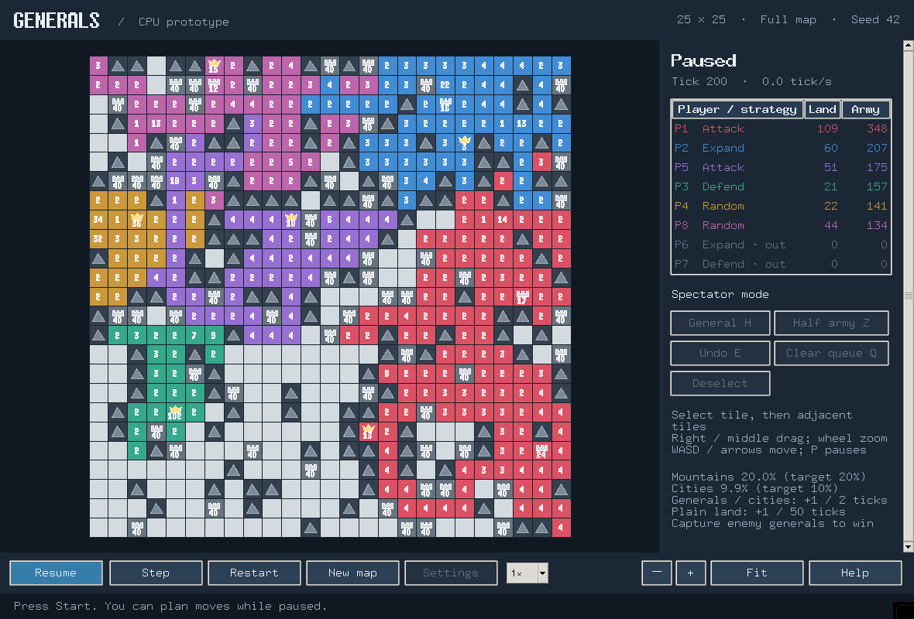

# CPU 原型实现与验收记录

日期：2026-09-26。版本：`generals-env 0.1.0`。

## 1. 交付状态

已依据设计方案实现可运行 CPU 原型，并在本机 `generals-rl` conda 环境完成可编辑安装。游戏环境完整位于 `env/`，未来算法目录 `rl/` 仅保留归属说明。运行时依赖 NumPy，GUI 使用标准库 Tk；不调用 PyTorch/CUDA，不安装额外 CUDA 编译包。

- 核心：先增兵、按编号决策和结算、四邻移动、留一兵／半兵、严格大于才占领、主城淘汰继承、立即自然终局。
- 对局：2–8 人的每个整数人数，单个人类对抗 AI，或全 AI 对战；可复现地图及独立玩家随机流。
- 基础策略：进攻、扩张、防御、随机，保留原 JS 的行为特征，修复无限重试、失败后继续路径及隐藏地图访问等问题；不承诺每步与 JS 选择相同。
- GUI：地图、战争迷雾、排行榜、鼠标与键盘输入、64 步队列、半兵、撤销／清空、平移缩放、设置、暂停单步、同图重开、新地图、淘汰后继续观战。
- 非实时模拟：没有时间等待，支持批量局数、截断、JSON 汇总、可选动作记录和逐 tick 摘要重放校验。
- 预处理：合法动作掩码、四邻接拓扑、BFS、有限单源缓存、显式全点对最短距离及内存预算。



截图为本原型自身窗口，25×25、8 方、暂停于 tick 200。当前系统无合适中文字体时界面自动回退英文；棋盘和图标由 Canvas 绘制。

## 2. 立即运行

本机已安装，可以从仓库根目录直接启动：

```console
conda run -n generals-rl python -m generals_env play --players 4 --seed 42
```

启动后可先调整设置，再点击“开始”。鼠标点击己方格选择来源，连续点击相邻格排队；侧栏提供半兵、撤销、清空和取消选择按钮；滚轮缩放，中键／右键拖动平移。

无图形桌面或需要高速模拟时：

```console
conda run -n generals-rl python -m generals_env simulate --players 4 --size 25 --games 10 --max-ticks 20000 --seed 42
conda run -n generals-rl python -m generals_env watch --players 8 --size 35 --speed 10
```

第二条为 GUI 观战，仍需要可用桌面。详细安装、参数和 Python 接口见 [环境说明](../env/README.md)。在另一个检出目录使用时重新安装：

```console
conda run -n generals-rl python -m pip install -e ./env --no-deps --no-build-isolation
```

该安装命令利用本机已具备的 NumPy、setuptools 与 Tk。Windows 和 Linux 使用相同模块入口，显示服务由运行所在的桌面会话提供。

## 3. 实际模块边界

| 模块 | 职责 |
|---|---|
| `state.py`、`config.py` | 连续数组、静态布局、配置、动作和结果类型、严格输入验证 |
| `engine.py` | 规则和 tick 生命周期，不依赖 AI、GUI 或真实时间 |
| `mapgen.py` | 有限时间地图生成、出生点间距及连通性修复 |
| `observation.py` | 局部／全图观测、只读独立快照和动作掩码 |
| `pathfinding.py` | 与模型无关的拓扑和路径特征 |
| `controllers/` | 四个基础 AI、人类队列、控制器协议 |
| `runner.py` | 逐玩家观测和行动、终止／截断、异常停止、连续模拟 |
| `recording.py` | 初始状态、动作日志、规则版本和确定性校验 |
| `gui/`、`cli.py` | Tk 展示和交互、命令行启动 |

实施中保持了最简形式：不增加可编辑规则配置类、张量后端分发器或训练适配框架。设计里的 reset 由 `generate_map` 加新引擎／Runner 实现；同图重开从初始状态复制，并重建同种子的控制器。`Runner` 不隐式重置外部传入的控制器。

权威状态与玩家观测分离。LOCAL 中总兵力、领土与存活状态公开，但敌方城市总数为 `-1`，隐藏主城位置、军队和地形不通过缓存或策略寻路泄漏。全图快照和静态全地图预处理属于明确的特权入口。

未来算法可通过 `Controller` 协议或核心动作接口接入。数组结构、可复现动作轨迹及顺序语义可用于后续 GPU 实现对照；本期未实现 GPU 批次、多智能体训练包装、奖励、模型或优化器。

## 4. 验证结果

最终执行：

```console
DISPLAY=:1 /home/yuhangwang/miniforge3/envs/generals-rl/bin/python -m unittest discover -s env/tests -v
```

**95 项测试全部通过，2.640 秒，无跳过。** 其中 GUI 检查实际创建了 Linux/X11 窗口，并发送点击事件或调用可见按钮。

| 测试文件 | 数量 | 重点 |
|---|---:|---|
| `test_rules.py` | 19 | 增兵周期、战斗、继承、终局、整数精度及溢出 |
| `test_tick_order.py` | 4 | 固定顺序、阶段校验、分阶段与批量动作一致 |
| `test_mapgen.py` | 4 | 所有人数、多种密度和种子、连通性及拥挤地图 |
| `test_observation.py` | 9 | 八邻视野、未知区域、城市统计泄漏、快照隔离及动作掩码 |
| `test_pathfinding.py` | 9 | BFS、不可达、未知格策略、缓存隔离及全点对预算 |
| `test_controllers.py` | 20 | 四策略有界返回与可复现、人类排队和失败反馈 |
| `test_runner.py` | 9 | 逐时隙观测、截断、停止、帧采样独立性和记录重放 |
| `test_runtime_errors.py` | 10 | 控制器／记录错误、恢复统计、畸形日志输入 |
| `test_cli.py` | 3 | 无 GUI 导入、非法配置、完整命令行记录和重放 |
| `test_gui.py` | 8 | 6 项真实桌面检查、2 项时钟和跨平台滚轮检查 |

另外完成：

- 2、3、4、5、6、7、8 人分别运行最多 300 tick，启用每 tick 状态验证，均无错误。
- 清除 `DISPLAY` 和 `WAYLAND_DISPLAY` 后运行 5 局 15×15 四 AI 模拟；全部自然结束，总计 3155 tick，没有截断或错误。
- GUI 验证覆盖 2–8 人开局、15／25／35 地图、8 人地图展示、鼠标队列及缩放命中、设置模态锁定、同图重开一致性、人类淘汰后同局观战、控制器错误后停止和重新开局。
- 已检查游戏窗口截图，确认地图、侧栏及操作按钮可见。
- 无界面包导入检查确认未加载 Tk、PyTorch 或 RL 包。

测试原始输出保存于 [test_results_linux.txt](test_results_linux.txt)。无桌面时真实窗口测试会明确跳过，不能把这种结果当作 GUI 验收通过。

## 5. CPU 性能实测

CPU：Intel Core i7-14700KF。系统：Linux x86_64。Python 3.12.14、NumPy 2.5.2、Tk 8.6.13。每组 seed=42，山脉 20%、城市 10%，LOCAL，关闭动作记录、调试断言及内存追踪。顺序执行以下命令，每个组合测量一次，未做绑核或统计置信区间：

```console
python env/benchmarks/benchmark_cpu.py --size 15 --players 2 --ticks 2000
python env/benchmarks/benchmark_cpu.py --size 25 --players 4 --ticks 2000
python env/benchmarks/benchmark_cpu.py --size 35 --players 8 --ticks 2000
```

| 地图 | 玩家 | 地图生成含连通修复 | 核心 tick/s | AI 完整模拟 tick/s | AI 实际 tick | AI 停止原因 |
|---|---:|---:|---:|---:|---:|---|
| 15×15 | 2 | 10.14 ms | 27,221 | 1,134.9 | 84 | 自然终局，胜者 0 |
| 25×25 | 4 | 13.55 ms | 22,319 | 327.7 | 518 | 自然终局，胜者 0 |
| 35×35 | 8 | 50.83 ms | 17,764 | 168.2 | 2000 | 达到 2000 tick 截断 |

核心测试使用预生成动作，不含策略决策，不能代替端到端吞吐。AI 按进攻、扩张、防御、随机循环分配席位；双人组合只使用前两种。单次短局数据受地图、策略、自然终局和系统负载影响，不能视为稳定性能保证。八方样本达到上限只表示截断，没有按兵力强行指定胜者。

无显示器的 5 局 15×15 四 AI 批量样本耗时 4.711 秒，端到端约 669.8 tick/s、1.06 个完整局/s，包含地图初始化和策略创建。

25×25 静态地图的邻接预处理另测约 0.056 ms；全点对 BFS 约 55.0 ms，输出 `[625,625]` 的 int32 距离矩阵，占 1,562,500 字节。地图生成数据包含连通性修复，没有对其内部阶段单独拆分计时。

独立执行 `--size 25 --players 4 --ticks 2000 --memory`，`tracemalloc` 记录的 Python 分配峰值为 3,985,584 字节（约 3.80 MiB）。该范围包含基准预生成的 2000 tick 动作及两次运行的对象，并非进程 RSS 或纯环境常驻内存；内存追踪显著降低速度，其时序不与上表混用。原始结果见 [benchmark_results.json](benchmark_results.json)。

## 6. 已知边界与待验收项

- Linux/X11 已完成真实窗口自动交互检查和截图检查；Windows 实机、不同系统的 100%／150%／200% DPI 尚未验收。Windows 滚轮分支已有测试，仍不能替代 Windows 实机检查。
- 未进行人工仅鼠标完成整局的长时间验收；已有测试覆盖主要鼠标交互、淘汰、终局规则和继续观战流程。没有定量 GUI 响应延迟或帧率报告。
- GUI 使用主线程和有限 tick 追赶，重计算会让显示变慢；最大吞吐使用 `simulate`。当前只有 1×／2×／5×／10× GUI 速度。
- 四种基础 AI 可能僵持；批量模式使用 `max_ticks` 明确截断。策略保留行为特征，不保证强度、胜率平衡或复现 JS 每步动作。
- 当前记录提供动作重放校验，没有录像播放器、联网、训练接口或 GPU 后端。

## 7. 后续地图连通修复（2026-09-27）

地图现已升级为所有非山脉格四邻接连通，使用一次多源 0–1 BFS 修复，完整套件 106 项测试通过。本文上方数据保留首版验收记录；最新地图规则、测试与性能见 [全图连通修复记录](map_connectivity_update.md)。
